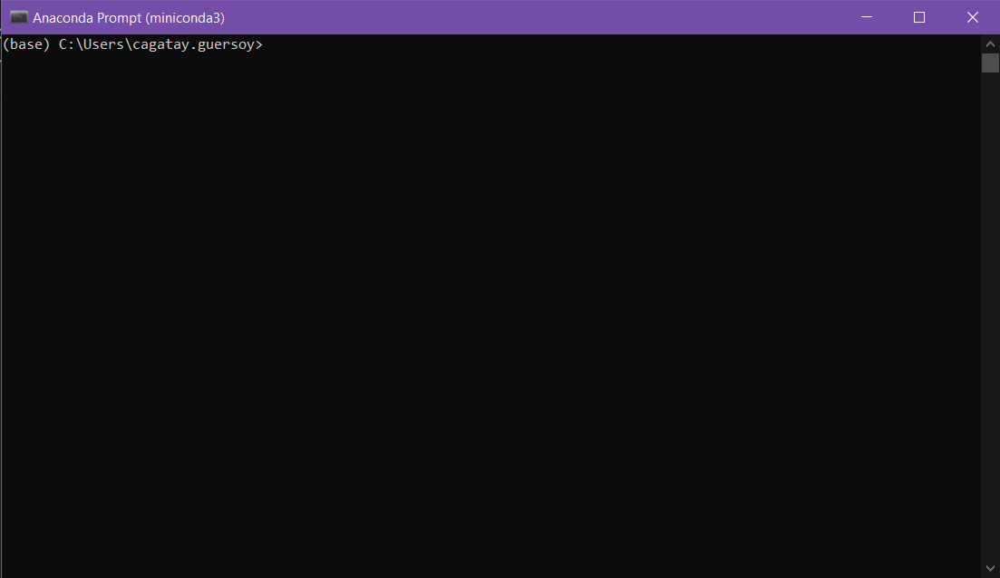

# Installation Guides

A step by step guide to install Conda with Python and PsychoPy.

## Conda installation guide

- Two options exist
  - With GUI support: Anaconda
    - Pros: Ease of use
    - Cons: Clunky and takes space
  - Without GUI: Miniconda
    - Pros: Does not take as much space
    - Cons: Terminal based, so one needs to remember some commands

### Anaconda installation

- Jump to this [link](https://www.anaconda.com/download) and download the installer for the appropriate OS.
- Follow the installation guide and you're done

### Miniconda installation

- Jump to this [link](https://docs.anaconda.com/free/miniconda/miniconda-install/) and download the installer for the appropriate OS.
- Follow the installation guide and you're done

### Check your Conda installation

#### Windows

- From Start Menu search for "Anaconda prompt" and start it
  
- You should have started a terminal similar to the screenshot below.
- Important part is, you should see your base Conda environment activated in the beginning of the path in the beginning of the line as: `(base)`
  

#### MacOS / Linux

- Start your favourite terminal
- You should see your base Conda environment activated in the beginning of the path in the beginning of the line as: `(base)`

## PsychoPy installation guide

At this stage we will create a dedicated virtual environment for PsychoPy and subsequently install the package.
Having a dedicated virtual environment is essential for future reproducibility and code sharing.

### Interlude: Installing libmamba-solver

Conda's own solver is based on Python and it is rather sluggish.
Hence it always makes sense to upgrade it to "Libmamba" solver, which is made with C++ and significantly faster in installing packages.

- Start your Anaconda prompt (Windows) or terminal (MacOS/Linux)
- Type in the following command

```
conda install -n base conda-libmamba-solver
conda config --set solver libmamba
```

- This will install the libmamba-solver and activate it

### Back to the topic: Creating the virtual environment for PsychoPy

- Now a creaating a dedicated conda virtual environment is _not required but strongly suggested_
- To achieve that, type in the following command in your Anaconda prompt / terminal

```
conda create --name psychopy python=3.10
```

- Which will create a virtual environment named _psychopy_ with Python version 3.10
  

### PsychoPy installation

- Start your Anaconda prompt (Windows) or terminal (MacOS/Linux)
- Now you need to activate your _psychopy_ environment.
  To achieve that, just type in the following command:

```
conda activate psychopy
```

- Now you should see that the `(base)` part in the beginning of your Anaconda prompt/terminal is replaced with `(psychopy)`.
  That means your _psychopy_ environment is now activated

- Type in the following command to download and install PsychoPy from the pip repository:

```
pip install psychopy
```

- Now you should see a screen similar to this, you should type in `y`, punch `enter` and let the installer handle the rest
  

- After the installation is completed you can simply check if it was successful by listing all the packages in the `(psychopy)` environment and filtering for the `psychopy` package with the following command:

```
conda list psychopy
```

You're done!
Now you can start PsychoPy by simply typing `psychopy` in a Anaconda prompt/terminal where the `(psychopy)` environment is activated
