# Step-by-Step Guide for Creating an Image Rating Task Experiment Using PsychoPy Builder interface

## Step 1: Set Up the Experiment

- Open PsychoPy Builder:

  - Launch PsychoPy and select the Builder view.

- Create a New Experiment:
  - Go to File > New.
  - Save the experiment with the name `stroop.psyexp`
    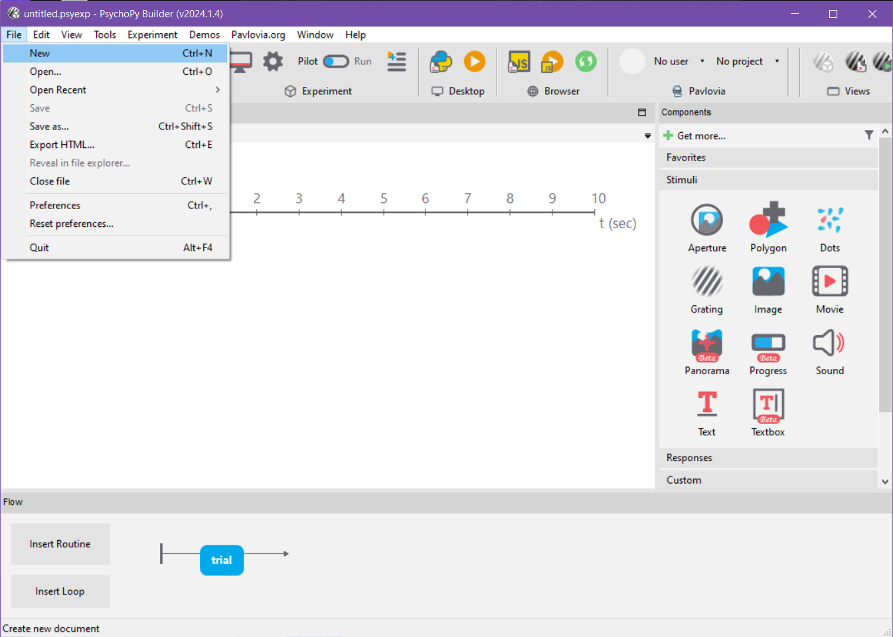

## Step 2: Define the Image Schedules

- Create a image schedule file:

  - Create an CSV file to define the image paths for your experiment.
    The file should have columns for the text stimuli and their corresponding colors. For example:

  | image         |
  | ------------- |
  | imgs/img0.png |
  | imgs/img1.png |
  | imgs/img2.png |
  | imgs/img3.png |
  | imgs/img4.png |
  | imgs/img5.png |
  | imgs/img6.png |
  | imgs/img7.png |
  | imgs/img8.png |
  | imgs/img9.png |

  - You can create the table quickly with python with the following code snippet

  ```python
    import csv
    # Base path for the images
    base_path = "imgs/img"
    # Number of images
    num_images = 10
    # Data for the table
    data = [[f"{base_path}{i}.png"] for i in range(num_images)]
    # Column header
    header = ["image"]
    # Write to CSV file
    with open('images.csv', 'w', newline='') as file:
        writer = csv.writer(file)
        writer.writerow(header)
        writer.writerows(data)
  ```

## Step 3: Build the Routines

- How to add a Routine:

  - Click on the `Insert Routine` button on bottom left
  - Select `new` and name it `trial` or if you already have `trial` select it

    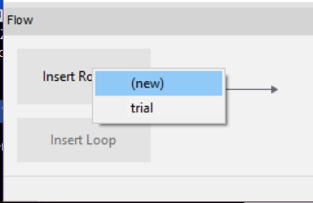

  - Now on the `Flow` click on the arrow to place the `trial` routine

    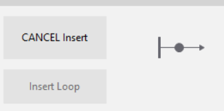

  - You `Flow` should look like this:

    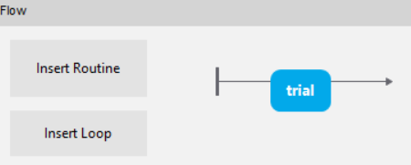

- How to add a Text Component:

  - Add a Text component to the routine. Set its properties as follows:

    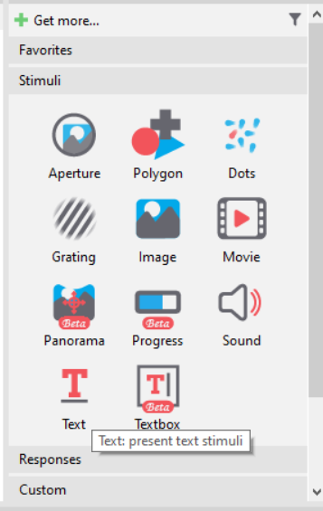

    - `Text`: The text to be displayed
    - `Duration` (s): Leave it blank or set to a desired duration, e.g., 1.0
    - `Units`: Leave at default

### - `Welcome` Routine

- Click on the `Insert Routine` button on bottom left
- Select `new` and name it `welcome`
- One needs a `Text` and `Keyboard` component for the `Welcome` routine as the participants will be let to read the welcome and instructions with their own pace
- Add a `Text` component, you can name it `text`
- Do not type in any `Stop` time, this will be checked by the keyboard
- Type the welcome text to be shown in the `Text` field
- Now add a `Keyboard` component, name it `key_resp` for keyboard responses
- Again do not type in any `Stop` time
- Set `Register keypress on...` field as `press`
- And allowed keys to `'return'` as we will use the `Enter` key for to move on to the next screen
- Click `OK`
  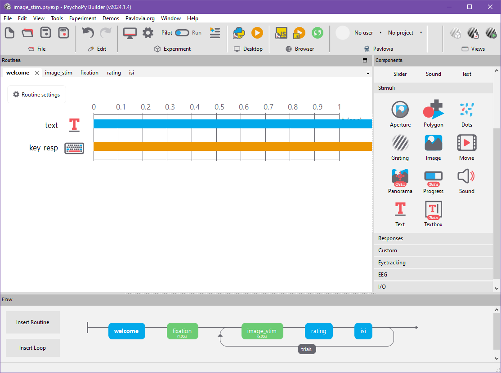

### - `Fixation cross` Routine

- Create the `Fixation` routine first
- Now we need a Fixation cross
- As PsychoPy is able to display polygons via drawing the points specified, we will use the `Polygon` component
- PsychoPy already offers the following options natively, without thinking about the individual points:
  So let's leverage that
- Select `Polygon` component from the menu
- Set the duration to 2 seconds
- Set the `Shape` option to cross
- Now switch to the `Layout` menu and set the size to `(0.1, 0.1)`. This means that we will create a shape with `(width, height)` pair of `10%` of the half of the screen
- In `Appereance` menu, set the `Fill color` and `Border color` to `Black`.
- Click `OK` and now you have the fixation cross

### - `Image_Stim` Routine

- Next up is displaying the stimuli!
- Create a routine with the name of `image_stim`
- To achieve that, add an `Image` component from the components menu, name it `image_disp` and set the `Image` field to `$image` which is the column header in the `.csv` file

### - `Rating` Routine

- Now we create a routine for displaying the rating scale and getting the responses
- To achieve that we need a `slider`, a `text`, a `keyboard` and a `code` component.
- Create the `slider` component and set the values as the following images
  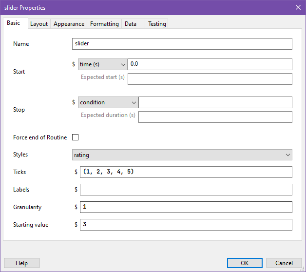
  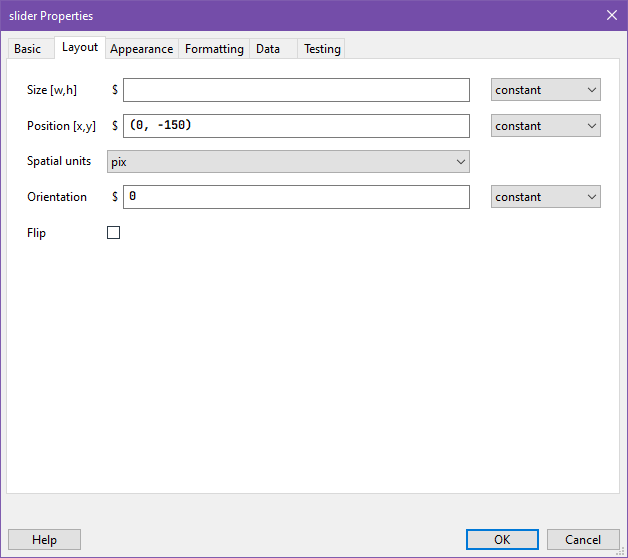
  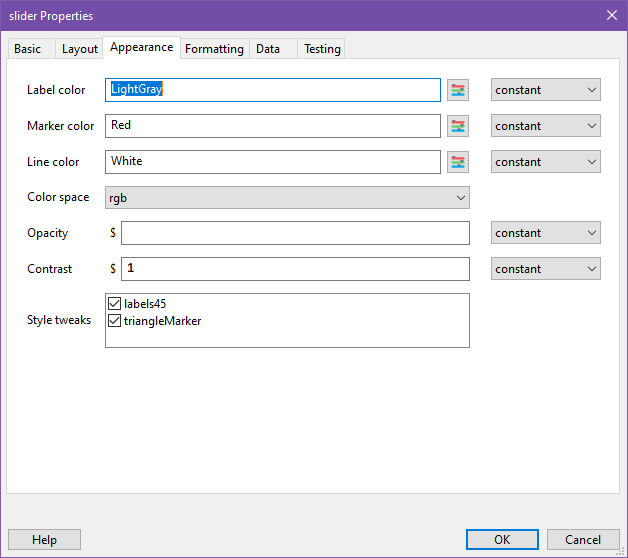
- Now create a `text` component, remove the `duration` value and set the `Text` field to the text you would like to display on top of the slider, for this case _"How realistic do you think this image is?"_
- Create a `keyboard` component with the following properties
  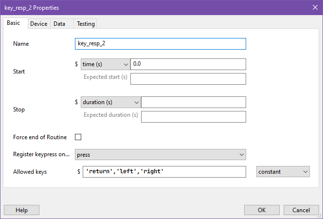
- Finally create a `code` component.
  - We will have three properties for this `code` component: `Begin Routine`, `Each Frame`, `End Routine`
  - In `Begin Routine` tab, add the following script to initialise the keyboard and rating
    ```python
    # Initial position of the slider
    current_slider_pos = slider.markerPos
    # Ensure markerPos is initialized to avoid NoneType issues
    if current_slider_pos is None:
        current_slider_pos = slider.ticks[0]
    # Define the slider's range based on its ticks
    slider_min = min(slider.ticks)
    slider_max = max(slider.ticks)
    # Clear the keyboard events
    key_resp.clearEvents()
    key_resp_2.clearEvents()
    # Create a dummy variable to get the initial key press
    dummy = key_resp_2.getKeys()
    ```
  - In `Each Frame` tab, add the following script to do the keypress checks for each frame
    ```python
    # Get the keys pressed
    keys = key_resp_2.getKeys()
    # Adjust the slider position based on key presses
    for key in keys:
    if key.name == 'left':
        current_slider_pos -= 1  # Move left
    elif key.name == 'right':
        current_slider_pos += 1  # Move right
    elif key.name == 'return':
        # Confirm selection and end routine
        thisExp.addData('final_slider_position', slider.markerPos)
        continueRoutine = False
    # Ensure the position stays within the slider's range
    current_slider_pos = max(slider_min, min(slider_max, current_slider_pos))
    # Update the slider position
    slider.markerPos = current_slider_pos
    ```
  - In `End Routine` tab, add the following script to save the final position of the slider
    ```python
    # Save the final slider position
    thisExp.addData('final_slider_position', slider.markerPos)
    ```

### - `Inter-stimulus Interval` Routine

- Another important aspect is creating a random "Inter-stimulus interval" after the presentation of each stimulus
- Create a new routine, call it `isi`
- During the ISI we will display a fixation cross, so you can go back to the `fixation` routine and follow the steps again just to add the fixation cross polygon but this time set the duration to `$t_isi`
- Now we have to introduce the random time delay
- For that we can utilize the `random` class of Python by creating a `Code` component
- Create a `Code` component and name it `t_isi`
- Go to the `Begin routine` tab and paste the following code snippet which will randomly sample an real number between 0 and 1
  ```python
  import random
  t_isi = random.uniform(0, 1)
  ```
- Confirm with `OK`

### - Trial loop

- Finally the most important step, displaying all the stimuli listed in the `images.csv`
- Click `Insert Loop` in the `Flow` menu displayed at the bottom

  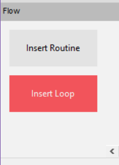

- Now click on the beginning and the end of our stimuli displaying `Routines`, so before `image_stim` and after `isi`

  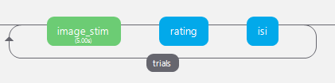

- The loop is now set, but we need to set some variables
- Set the `Name` as `trials`
- `Loop type` as `random` for our case. In other cases, if you have already provided a pseudorandomised list, you can select `sequential`
- `Num. repeats` is the number of times that this loop will be repeated. You can set it to how many times you want it to repeat
- Finally we need to provide the `conditions.csv` file to the loop. Do it by clicking the `Folder selection` button on the right side of the `Conditions` field. If you have correctly set the conditions file, you should be able to see the number of parameters and conditions exist in the file.
- Confirm with `OK`

  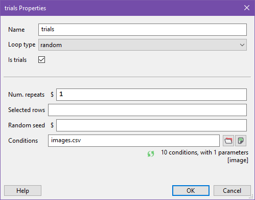

## Done! You have successfully created a Stroop task

- Your final `Flow` should look like this:

  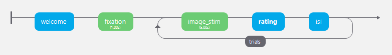

- You can now test the experiment by clicking the `Play` button on the top menu

  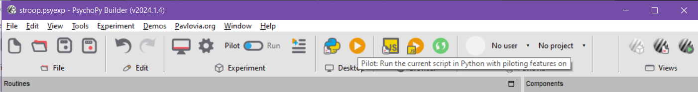
