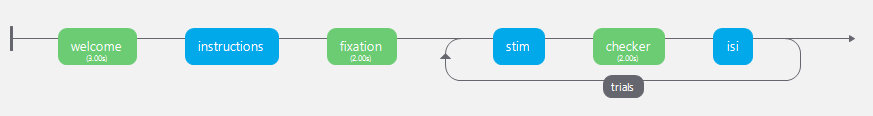

# Creating a basic Stroop task experiment from scratch using builder interface

## Step 1: Set Up the Experiment

- Open PsychoPy Builder:

  - Launch PsychoPy and select the Builder view.

- Create a New Experiment:
  - Go to File > New.
  - Save the experiment with the name `stroop.psyexp`
    

## Step 2: Define the Conditions

- Create a Conditions File:

  - Create an CSV file to define the conditions for your experiment.
    The file should have columns for the text stimuli and their corresponding colors. For example:

  | word | color |
  | ---- | ----- |
  | RED  | red   |
  | BLUE | blue  |
  | BLUE | red   |
  | BLUE | red   |
  | RED  | blue  |
  | BLUE | blue  |
  | RED  | red   |
  | RED  | blue  |
  | BLUE | red   |
  | RED  | blue  |

  - You can create the table quickly with python with the following code snippet

  ```
  import pandas as pd
  import random
  # create the lists
  words = ['BLUE']*5 + ['RED']*5
  colors = ['blue']*5 + ['red']*5
  # shuffle them and create the dataframe with using them
  random.shuffle(words)
  random.shuffle(colors)
  # create the dataframe with using dictionary declaration
  df_conditions = pd.DataFrame({'word':words, 'color':colors})
  # save the dataframe
  df_conditions.to_csv('conditions.csv')
  ```

## Step 3: Build the Routines

- How to add a Routine:

  - Click on the `Insert Routine` button on bottom left
  - Select `new` and name it `trial` or if you already have `trial` select it

    

  - Now on the `Flow` click on the arrow to place the `trial` routine

    

  - You `Flow` should look like this:

    

- How to add a Text Component:

  - Add a Text component to the routine. Set its properties as follows:

    

    - `Text`: `$word` (use the variable name from your conditions file)
    - `Color`: `$color` (use the variable name from your conditions file)
    - `Duration` (s): Leave it blank or set to a desired duration, e.g., 1.0
    - `Units`: Leave at default

### - `Welcome` Routine

- Click on the `Insert Routine` button on bottom left
- Select `new` and name it `welcome`
- Now let's add a `Text` component from the right hand side
- Name the component, `welcome_txt` might be an option
- To display the welcome screen for `3` seconds set the `Start` to 0 and `Stop` to 3 seconds
  - You can set it how long you want
- Type the welcome text to be shown in the `Text` field
- Click `OK`; now you should have your `welcome` routine

  

### - `Instructions` Routine

- Create the `Instructions` routine first
- One needs a `Text` and `Keyboard` component for the `Instructions` routine as the participants will be let to read the instructions with their own pace
- Add a `Text` component, you can name it `text`
- Do not type in any `Stop` time, this will be checked by the keyboard
- Type in the instructions in the `Text` field and click `OK`

  

- Now add a `Keyboard` component, name it `key_resp` for keyboard responses
- Again do not type in any `Stop` time
- Set `Register keypress on...` field as `press`
- And allowed keys to `'return'` as we will use the `Enter` key for to move on to the next screen
- Click `OK`

  

### - `Fixation cross` Routine

- Create the `Fixation` routine first
- Now we need a Fixation cross
- As PsychoPy is able to display polygons via drawing the points specified, we will use the `Polygon` component
- PsychoPy already offers the following options natively, without thinking about the individual points:

  

  So let's leverage that

- Select `Polygon` component from the menu
- Set the duration to 2 seconds
- Set the `Shape` option to cross
- Now switch to the `Layout` menu and set the size to `(0.1, 0.1)`. This means that we will create a shape with `(width, height)` pair of `10%` of the half of the screen
- In `Appereance` menu, set the `Fill color` and `Border color` to `Black`.
- Click `OK` and now you have the fixation cross

### - `Stim` Routine

- Next up is displaying the stimuli!
- Create a routine with the name of `stim`
- We need two components for this routine, one `Text` and one `Keyboard`
- Name the `Text`routine as `stim_text`and with no duration

  - For the text, we will use the variable from the `.csv`stimuli file
  - It should be the header of the column, therefore in text field type in `$word`

    

  - Now to set the color of the word, switch to the `Appereance` section and in `Foreground color` section type `$color` which is the header of the color column in the stimuli `.csv` file
  - Don't forget to set the dropdown menu on the right side of the `Foreground color` section to `set every repeat` so that in every step the word and the color of the word is re-set

    

  - Click `OK` and confirm

- Now create a `Keyboard` component and name and name it `key_resp_2`

  - Set the duration to `0` and `Allowed keys` to `'left','right'` as we will only check left and right keypresses for the correctness of the participant reactions
  - Click `OK` and confirm

    

### - `Checker` Routine

- Now we create a routine that would "check" if the participant succesfully selected the right color-word combination or not
- For this end, we need a `Code` component to handle the checking process and a `Text` component to display the feedback
- First create a `Code` component

  - Identical to the previous step, we can call the `color` variable to get the currently displayed object's color, which is gathered from the `.csv`file
  - Moreover, we can gather the keypresses from the individual `Keyboard`components, by calling the variable `key_resp_2.keys`
  - Now click the `Begin Routine` option from the upper menu and start writing your `checker` script.

    - Hint, you can use this:

    ```
    if color == 'red' and key_resp_2.keys == 'left':
        text = 'correct'
    elif color == 'red' and key_resp_2.keys == 'right':
        text = 'wrong'
    elif color == 'green' and key_resp_2.keys == 'right':
        text = 'correct'
    elif color == 'green' and key_resp_2.keys == 'left':
        text = 'wrong'
    ```

- Click `OK` and confirm

  

- Next step is creating the `Text` component for feedback displaying
- Create a `Text` component and name it `text_2`
- Type `$text` (the variable which you've assigned the result in the the checking script) in the `Text`block and
- Confirm that the dropdown menu on the right side is set to `set every repeat`
- Confirm with `OK`

  

### - `Inter-stimulus Interval` Routine

- Another important aspect is creating a random "Inter-stimulus interval" after the presentation of each stimulus
- Create a new routine, call it `isi`
- During the ISI we will display a fixation cross, so you can go back to the `fixation` routine and follow the steps again just to add the fixation cross polygon but this time set the duration to `$t_isi`
- Now we have to introduce the random time delay
- For that we can utilize the `random` class of Python by creating a `Code` component
- Create a `Code` component and name it `t_isi`
- Go to the `Begin routine` tab and paste the following code snippet which will randomly sample an real number between 0 and 1
  ```
  import random
  t_isi = random.uniform(0, 1)
  ```
- Confirm with `OK`

### - Trial loop

- Finally the most important step, displaying all the stimuli listed in the `conditions.csv`
- Click `Insert Loop` in the `Flow` menu displayed at the bottom

  

- Now click on the beginning and the end of our stimuli displaying `Routines`, so before `stim` and after `isi`

  

- The loop is now set, but we need to set some variables
- Set the `Name` as `trials`
- `Loop type` as `random` for our case. In other cases, if you have already provided a pseudorandomised list, you can select `sequential`
- `Num. repeats` is the number of times that this loop will be repeated. You can set it to how many times you want it to repeat
- Finally we need to provide the `conditions.csv` file to the loop. Do it by clicking the `Folder selection` button on the right side of the `Conditions` field. If you have correctly set the conditions file, you should be able to see the number of parameters and conditions exist in the file.
- Confirm with `OK`

  

## Done! You have successfully created a Stroop task

- Your final `Flow` should look like this:

  

- You can now test the experiment by clicking the `Play` button on the top menu

  
